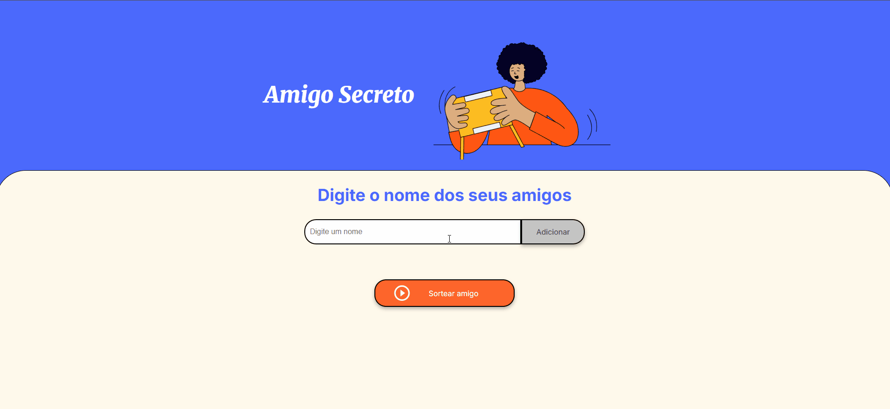

# Amigo Secreto

Este projeto foi criado como um desafio proposto na formação Oracle Next Education e permite que usuários adicionem nomes a uma lista e realizem um sorteio aleatório para determinar o "Amigo Secreto". Ele foi desenvolvido utilizando HTML, CSS e JavaScript.

## 🚀 Funcionalidades

- Adicionar nomes à lista
- Validar entradas para evitar nomes vazios
- Exibir a lista de participantes
- Realizar o sorteio aleatório
- Exibir o nome sorteado na tela

## 🛠️ Tecnologias Utilizadas

- HTML
- CSS
- JavaScript

## 📌 Como Usar

1. Clone este repositório:
   ```sh
   git clone https://github.com/rhuan-lima/challenge-amigo-secreto_rhuan-lima
   ```
2. Acesse o diretório do projeto:
   ```sh
   cd challenge-amigo-secreto_rhuan-lima
   ```
3. Abra o arquivo `index.html` no navegador.

## 📷 Demonstração



---

Feito com ❤️ por [Rhuan Lima](https://github.com/rhuan-lima/)

